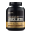
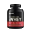
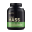
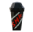

# pz-mod-protein-shake

The Protein Shake Mod for Project Zomboid introduces a new consumable item—protein shakes—designed to help players maintain their strength and endurance in the zombie apocalypse. This mod adds various flavors of protein shakes, each providing a balance of calories, hydration, and essential nutrients. Players can craft these shakes using ingredients like protein powder, milk, and fruits, making them a valuable resource for survivalists looking to sustain muscle mass and avoid malnutrition. Perfect for fitness-focused survivors, this mod enhances gameplay by offering a realistic nutrition boost to keep characters strong while battling the undead.

## Features

New Consumable: Protein Shakes

- Several types of protein shakes, each with unique nutritional benefits.

  - 100% Whey Protein Isolate; focus on building more muscle
  - 100% Whey Protein; to build muscle and maintain weight
  - Serious Mass Gainer; to gain more weight

- Helps maintain strength and endurance, reducing the risk of losing muscle mass.

## Crafting System

Players can craft protein shakes using ingredients like:

- Protein Powder (1 scoop). There are total of 31 scoops.
- Protein Shaker
- Water >= 300ml

| Icon                                                                                         | Name                     | Proteins | Carbs | Lipids | Calories |
| -------------------------------------------------------------------------------------------- | ------------------------- | -------- | ----- | ------ | -------- |
|  | 100% Whey Protein Isolate | 25       | 1     | 0.5    | 110      |
|     | 100% Whey Protein         | 24       | 2     | 1.5    | 120      |
|      | Serious Mass Gainer       | 25       | 126   | 2.25   | 625      |
|           | Protein Shaker            |          |       |        |          |

## Nutrition & Survival Benefits

- Protein boost helps improving XP gained from excercises.
- Improve endurance and reduce pain (drink it when got pain after excercise).
- Medium in calories and high protein, maintain current weight, preventing fatigue.
- Provides hydration, making it a great alternative to water.

## Spawning Areas

Protein shakers and powders be found in crats, lockers, gyms, supermarkets, and kitchens.

## Note

See Protein Boost Benefits at [PZ Wiki - Exercise](https://pzwiki.net/wiki/Exercise) document
